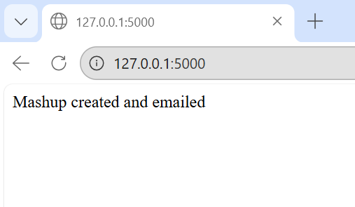

#  Mashup Generator — YouTube Audio Mashup Automation

##  Project Overview

This project builds an automated **Mashup Generator** that downloads multiple songs of a given singer from YouTube, extracts audio, trims a fixed duration from each track, merges them into a single mashup file, and delivers the output to the user.

The project is implemented in two parts:

* **Program 1 — Command Line Mashup Tool**
* **Program 2 — Web-based Mashup Service**

---

##  Problem Statement

Create a system that:

* Downloads N videos of a given singer from YouTube (N > 10)
* Converts videos to audio
* Extracts first Y seconds from each audio (Y > 20 sec)
* Merges all clips into one mashup file
* Provides:

  * Command line interface
  * Web app interface
  * Email delivery of mashup file

---

##  Features

###  Program 1 — Command Line Tool

* Takes arguments from terminal
* Downloads YouTube audio using `yt-dlp`
* Converts to MP3 using FFmpeg
* Trims fixed duration from each file
* Merges clips into one mashup
* Validates input parameters
* Handles download failures safely

###  Program 2 — Web Application

* Clean web UI form
* User inputs:

  * Singer name
  * Number of videos
  * Clip duration
  * Email address
* Generates mashup automatically
* Sends mashup ZIP via email
* Styled frontend interface

---

##  Methodology

### Step 1 — Input Collection

User provides:

* Singer name
* Number of videos (N)
* Clip duration (seconds)

### Step 2 — Audio Download

* Use `yt-dlp` search query:

```
ytsearchN:"Singer Name songs"
```

* Best available audio stream downloaded

### Step 3 — Audio Extraction

* FFmpeg extracts MP3 audio
* Stored in `audios/` folder

### Step 4 — Audio Trimming

* `pydub` trims first Y seconds
* Clips saved in `clips/`

### Step 5 — Mashup Creation

* All clips merged sequentially
* Exported as final mashup.mp3

### Step 6 — Delivery (Program 2)

* Mashup zipped
* Sent via SMTP email

---

##  Tech Stack

| Tool   | Purpose          |
| ------ | ---------------- |
| Python | Core language    |
| yt-dlp | YouTube download |
| FFmpeg | Audio conversion |
| pydub  | Audio processing |
| Flask  | Web server       |
| SMTP   | Email sending    |

---

##  Project Structure

```
mashup-generator/
│
├── program1/
│   └── <rollnumber>.py
│
├── program2/
│   └── app.py
│
├── requirements.txt
│
└── README.md
│
└── Images
    └── mashupsuccessmsg.png
    └── mashupgen.png

```

---

##  How To Run — Program 1

Install dependencies:

```
pip install yt-dlp pydub
```

Install FFmpeg and add to PATH.

Run:

```
python <rollnumber>.py "Singer Name" 15 30 output.mp3
```

---

##  How To Run — Program 2

```
pip install flask yt-dlp pydub
python app.py
```

Open browser:

```
http://127.0.0.1:5000
```

Fill form → mashup generated → email sent.

---

##  Email Configuration

Email credentials are loaded using environment variables for security.

Set them locally before running:

Windows:
set MASHUP_EMAIL=yourgmail@gmail.com
set MASHUP_APP_PASS=your_app_password

Linux/Mac:
export MASHUP_EMAIL=yourgmail@gmail.com
export MASHUP_APP_PASS=your_app_password

---

##  Screenshots

### Web App Interface


### Email Received



---

##  Performance Notes

* Download time depends on internet speed
* Typical mashup generation: **4–8 minutes**
* Large N increases processing time

---

##  Limitations

* YouTube bot verification may block some videos
* Depends on FFmpeg installation
* Email sending requires Gmail app password
* Not optimized for parallel downloads

---

##  Author

**Name:** **Khushnoor Kaur**
**Roll No:** **102303219**
**Course:** **Predictive Analytics Using Statistics**

---


